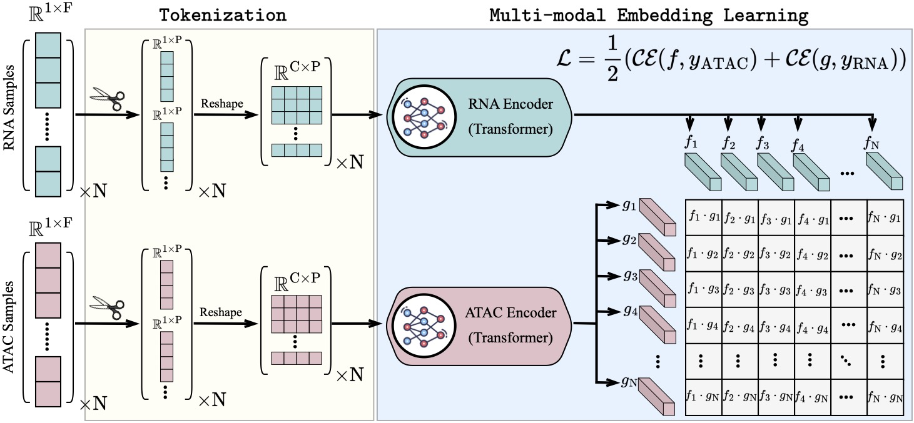

# scCLIP: Multi-modal Single-cell Contrastive Learning Integration Pre-training


## Download data 
Download [multiome](https://www.dropbox.com/scl/fi/llehgmu928ii83u7jc8u9/fetal.h5mu?rlkey=e6h8d5l8fma7m2pzhxk8wqec7&dl=0) data folder under data/  
- dataset:
  - Brain
    - train: AD
    - test: human_brain_3k
  - Fetal
    - train: fetal
    - test: 

## Install
```
pip install .
pre-commit install --hook-type pre-push
```

## Run 
```
python train_clip.py --data_dir AD --logit_scale 1
```

## Load Pretrain model
The model should saved under `path`/lightning_logs/checkpoints/epochxx-stepxx.ckpt
```
python train_clip.py --data_dir AD --checkpoint model.ckpt
```
The results will be saved under the same `path` 
